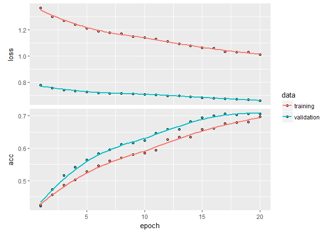

Keras exercise: simple feedforwark network to predict extraversion based on forum posts
================

<h3>
Introduction
</h3>
In this document, we'l play around with a nice dataset available freely on Kaggle.

Data consists of 8675 individuals. There are two variables: TYPE and POSTS. TYPE stands for personality type, as indicated by the Myers - Briggs personality tests. POSTS is a sample of text written by this person, on a forum dedicated to the MBTI personality theory.

Here we'll show how to transform such data and train a neural network to predict personality traits.

<h3>
Preliminary work
</h3>
We start with loading necessary libraries and reading the data.

``` r
library(reshape2)
library(tidytext)
library(dplyr)

dmb <- read.csv("mbti_1.csv", stringsAsFactors = FALSE)


str(dmb)
```

    ## 'data.frame':    8675 obs. of  2 variables:
    ##  $ type : chr  "INFJ" "ENTP" "INTP" "INTJ" ...
    ##  $ posts: chr  "'http://www.youtube.com/watch?v=qsXHcwe3krw|||http://41.media.tumblr.com/tumblr_lfouy03PMA1qa1rooo1_500.jpg|||e"| __truncated__ "'I'm finding the lack of me in these posts very alarming.|||Sex can be boring if it's in the same position ofte"| __truncated__ "'Good one  _____   https://www.youtube.com/watch?v=fHiGbolFFGw|||Of course, to which I say I know; that's my bl"| __truncated__ "'Dear INTP,   I enjoyed our conversation the other day.  Esoteric gabbing about the nature of the universe and "| __truncated__ ...

As you can see, both variables are string variables. Type holds information on personality type; posts is a sample of text written by that person.

Next, we will transform the data to a more usable format. We're going to process the text field and extract every word from it. In the end, one row in the transformed dataset will represent one word used by one person. In the meantime, we're going to drop all the english stop words and some other uninteresting but popular terms, using the <i> anti\_join </i> function.

``` r
#create an ID for each person
dmb$id <- 1:nrow(dmb)


#transforming data to long format (grain: ID, word). 
#Dropping stop words & couple other uninteresting words.
data(stop_words)
words_to_drop <- data_frame(word = c('â', 'ã', '1w2', '4w5', '5w4', '5w6', '6w7',
                                    '9w1', '6w5', '9w1', 'www.youtube.com', 'http', 'https', 
                                    'infj', 'entp', 'intp', 'intj', 'entj', 'enfj', 
                                    'infp', 'enfp', 'isfp', 'istp', 'isfj', 'istj', 
                                    'estp', 'esfp', 'estj', 'esfj' ))


dmb_long <- dmb %>%
  unnest_tokens(word, posts) %>%
  anti_join(stop_words) %>%
  anti_join(words_to_drop)

#this function will drop all numbers from the word field
remove_numbers <- function(d) {
  d <- mutate(d,
              is_number = ifelse(is.na(as.numeric(word)), 0, 1))
  d <- filter(d, is_number == FALSE) %>% select(-is_number)
}

#let's stick to words longer than 3 chars
dmb_long <- remove_numbers(dmb_long) %>%
  filter(nchar(word) > 3)


head(dmb_long)
```

    ##   type id                           word
    ## 1 INFJ  1                          watch
    ## 2 INFJ  1                    qsxhcwe3krw
    ## 3 INFJ  1               media.tumblr.com
    ## 4 INFJ  1 tumblr_lfouy03pma1qa1rooo1_500
    ## 5 INFJ  1                        moments
    ## 6 INFJ  1                          watch

As you can see, still there's a lot of meaningless words in there. We don't really need to care about that though, because we're going to drop all uncommon words.

Let's reshape the dataset again. First, we will only use words that were used by at least 500 people in our sample. Second, we will transform the data from long to wide format. We want each row to represent one person; we want each column to be an indicator for whether a person used a specific word or not.

``` r
#lets restructure data a bit:
#we'll create a wide data frame, one row per person
#with a long list of columns indicating whether a person used this word or not
dmb_wide <- group_by(dmb_long, word) %>%
  mutate(n = n_distinct(id),
         one = 1) %>%
  filter(n > 500) %>%
  unique() %>%
  select(id_ = id, type_ = type, word, one) %>%
  dcast(id_ + type_ ~ word, value.var = 'one')


dmb_wide[is.na(dmb_wide)] <- 0

head(dmb_wide[, 1:10])
```

    ##   id_ type_ ability absolutely accept account accurate acting action
    ## 1   1  INFJ       0          0      0       0        0      0      0
    ## 2   2  ENTP       0          0      0       0        0      0      0
    ## 3   3  INTP       1          1      0       0        1      0      0
    ## 4   4  INTJ       0          0      0       0        0      0      1
    ## 5   5  ENTJ       0          0      0       0        0      0      0
    ## 6   6  INTJ       0          0      0       0        0      0      0
    ##   actions
    ## 1       0
    ## 2       0
    ## 3       0
    ## 4       1
    ## 5       0
    ## 6       0

This data is almost ready for modelling.

<h3>
Preparing dataset for Keras
</h3>
Few things needs to be done before we build a model.

In this next section, we're going to: 1. Split the data to training/validation/test sets, 2. standarise variables (so that mean = 0, standard variation = 1).

``` r
# INTROVERSION / EXTRAVERSION.

#let's start with a simpler task.


dmb_wide <- mutate(dmb_wide,
                   type_ie = ifelse(substr(type_, 1, 1) == 'E', 1, 0))


Nvar <- ncol(dmb_wide)

#this our training sample
s <- sample(1:nrow(dmb_wide), 7500)

#and this will be our validation set 
#(subset of training sample)
sval <- sample(s, 1000)


#Keras wants martices.
#Here we creates all necessary matrices to train the model.
dmb_train_x <- dmb_wide[setdiff(s, sval), 3:(Nvar-1)] %>% as.matrix()
dmb_train_y <- dmb_wide[setdiff(s, sval), Nvar] %>% as.matrix()
dmb_val_x <- dmb_wide[sval, 3:(Nvar-1)] %>% as.matrix()
dmb_val_y <- dmb_wide[sval, Nvar] %>% as.matrix()
dmb_test_x <- dmb_wide[-s, 3:(Nvar-1)] %>% as.matrix()
dmb_test_y <- dmb_wide[-s, Nvar] %>% as.matrix()


#now, we scale the data so that mean=0, sd=1.
#Note that we apply mean/sd values from TRAINING dataset to TEST dataset.
#That's not a mistake. At no point during training should you use
#the testing samples.
mn <- apply(dmb_train_x, 2, mean)
std <- apply(dmb_train_x, 2, sd)

dmb_train_x <- scale(dmb_train_x, center = mn, scale = std)
dmb_val_x <- scale(dmb_val_x, center = mn, scale = std)
dmb_test_x <- scale(dmb_test_x, center = mn, scale = std)
```

<h3>
Training a network
</h3>
Now we're ready to train a feedforward network.

This is done by chaining different layers of network. Our network will have 3 dense layers of neurons (dense = every input is connected to every output of a neuron from previous layer). In the first layer, we need to specify the size of the input data - in our case, it's a number of words we have in the final dataset.

We will include two features to create resistance from overfitting:

1.  <i> kernel\_regularizer </i> adds a penalty to the loss function, proportional to the square value of the weight. This will ensure that weight values aren't too high, i.e. network isn't preferring a small subset of independent variables;

2.  <i> layer\_dropout </i> is a common technique used to avoid overfitting. Dropout means that during training phase, a random subset of weights will be set to 0. It is, in fact, a new, random source of noise, which forces the network to look for new predictive patterns.

``` r
library(keras)

#this is how you design a network in Keras - 
#you create a chain layers of neurons:
model <- keras_model_sequential() %>%
  layer_dense(units = 16, kernel_regularizer = regularizer_l2(0.001),
              activation = "relu", input_shape = c(Nvar - 3)) %>%
  layer_dropout(rate = 0.5) %>%
  layer_dense(units = 8, kernel_regularizer = regularizer_l2(0.001),
              activation = "relu") %>%
  layer_dropout(rate = 0.5) %>%
  layer_dense(units = 1, activation = "sigmoid")

summary(model)
```

    ## ___________________________________________________________________________
    ## Layer (type)                     Output Shape                  Param #     
    ## ===========================================================================
    ## dense_1 (Dense)                  (None, 16)                    15216       
    ## ___________________________________________________________________________
    ## dropout_1 (Dropout)              (None, 16)                    0           
    ## ___________________________________________________________________________
    ## dense_2 (Dense)                  (None, 8)                     136         
    ## ___________________________________________________________________________
    ## dropout_2 (Dropout)              (None, 8)                     0           
    ## ___________________________________________________________________________
    ## dense_3 (Dense)                  (None, 1)                     9           
    ## ===========================================================================
    ## Total params: 15,361
    ## Trainable params: 15,361
    ## Non-trainable params: 0
    ## ___________________________________________________________________________

Now, we need to compile the model and run it. That means we need to specify optimizer, loss function and metrics used for reporting. Compilation process is quite straightforward, it depends on the nature of the predictive task. In our case, it's a binary classification - therefore, we use the following:

``` r
model %>% compile(
  optimizer = "rmsprop",
  loss = "binary_crossentropy",
  metrics = c("accuracy")
)
```

Everything is ready now.

We will train the model in 20 epochs (i.e. network will go through training ataset 20 times). Batch size is a number of samples used per iteration (i.e. per one weights adjustment). We include the <i> class\_weight </i> parameter, because our classes are imbalanced: around 75% of the sample is introverted.

``` r
model_fit <- model %>% fit(
  dmb_train_x,
  dmb_train_y,
  epochs = 20,
  batch_size = 512,
  class_weight = list("0"=1,"1"=4),
  validation_data = list(dmb_val_x, dmb_val_y)
)

plot(model_fit)
```



We can use caret package to quickly calculate number of interesting stats on our prediction:

``` r
library(caret)
library(e1071)

df_eval <- cbind(predict_classes(model, dmb_test_x), dmb_test_y)

df_eval <- apply(df_eval, 2, as.factor) %>% as.data.frame()
names(df_eval) = c('predicted', 'real')

confusionMatrix(df_eval$predicted, df_eval$real, positive = '1')
```

    ## Confusion Matrix and Statistics
    ## 
    ##           Reference
    ## Prediction   0   1
    ##          0 659 118
    ##          1 240 158
    ##                                           
    ##                Accuracy : 0.6953          
    ##                  95% CI : (0.6681, 0.7215)
    ##     No Information Rate : 0.7651          
    ##     P-Value [Acc > NIR] : 1               
    ##                                           
    ##                   Kappa : 0.2649          
    ##  Mcnemar's Test P-Value : 1.605e-10       
    ##                                           
    ##             Sensitivity : 0.5725          
    ##             Specificity : 0.7330          
    ##          Pos Pred Value : 0.3970          
    ##          Neg Pred Value : 0.8481          
    ##              Prevalence : 0.2349          
    ##          Detection Rate : 0.1345          
    ##    Detection Prevalence : 0.3387          
    ##       Balanced Accuracy : 0.6528          
    ##                                           
    ##        'Positive' Class : 1               
    ## 

And here we are. Final accuracy of the model hits 70%, but upon closer look - there are some major problems present. Discrepancy between sensitivity and specificity shows that our model has difficulties identyfying extraverts. If you look at Pos Pred Value - which is, basically, conditional probability of detecting TRUE values (in our cases - extraverts), it's only around 36%. Kappa statistic around 0.2 indicates that the quality of model is actually poor, although it is better than a random prediction.

Number of things can be done further. Different network architecture is one idea. Perhaps we could spend more time during preliminary phase, e.g. include more words or drop words with no correlation to target variable.

We finish our story here, for now. Hope it was useful!
